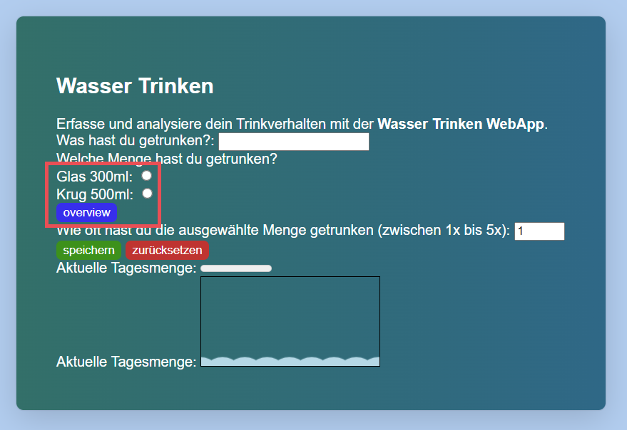
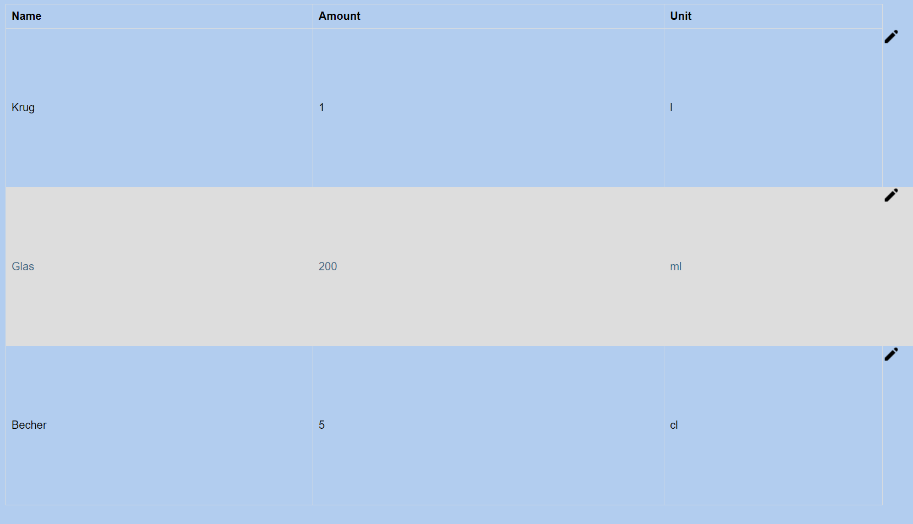
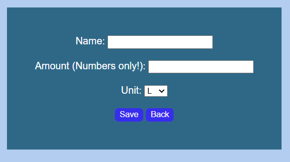
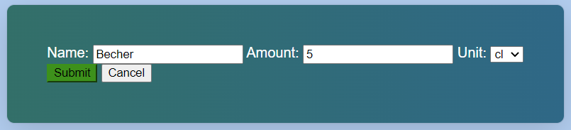

# Watertracking - Vessel overview

## Necessary configurations

A database with the name 'watertracking' needs to be created and the root needs to have access!

Please also have some Dummy data for starters or add some through the add button.

## Overview

You can get to this page when you click on the overview button on the Watertracking form right under the vessels to select. 

Here you can see all the vessels that you can choose from with their name, the amount that can fit in there and the unit for that amount. On the bottom there are two buttons one to go back to the Watertracking form and one to add a new vessel to the list. Next to every tuple there are three buttons. One to edit the data, one to look at it in detail and one to delete it.

The Overview Table:

## Detailed Overview

In the detailed Overview you can look at one tuple specifficly. There you can also see it's id, creation date and edit date next to the other categories also shown in the generale overview.

## Add Form

Here you can add your own vessel to the list. Give it a name, the amount that it holds and the corresbonding amount.

## Edit Form

Here you can edit your existing values. You can rename them, give them a different amount or a different meassuring unit. With cancel you discard all your changes and go straight back to the overview. With submit you submit your changes and will see them directly after beeing redirected to the overview. 

