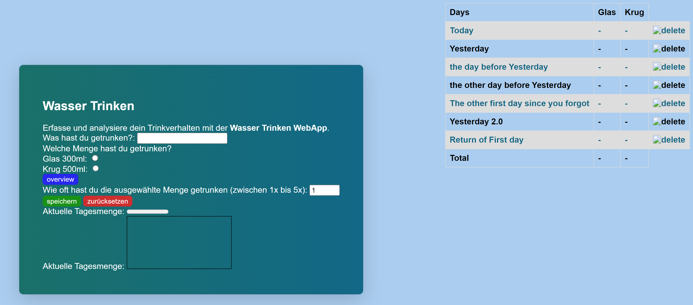
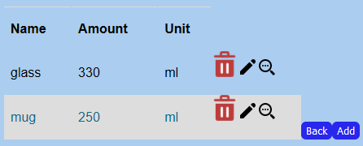

# *Watertracking* - Vessel overview

# Necessary configurations

A database with the name 'watertracking' needs to be created and the root needs to have access!

Please also have some Dummy data for starters or add some through the add button.

<br>

# Basics

## <u>Watertracking</u>

We extended the watertracking site with a persistent log to save the days you drank water.The HTML got extended with a standard table to display up to 7 days with a summary at the end. The Javascript file got local storage access to store a Json file with the relevant data.In this case an array of objects, in which the objects represent days.

In the initial run the array is empty and the the first day is created and displayed on the first line. A day keeps 3 values: amount of glases drank, amount of 'krugs' drank (yes I'm determined to keep it enlish) and a the date(yyyy-MM-dd).

On the nth approach the script checks if it exceeds 7 entries and would so remove the oldest entry. The second check is the day of todays entry and the day of the last logged entry. If this is the case the attributes will be updated. Otherwise a new day will be created and put on the first position at the string to be displayed on the first line.

An important task is the parsing between json and the objects. The Array already needs to keep the values "stringyfiy"-state to be able to cast the in a Json and back to objects!



## <u>Overview</u>

You can get to this page when you click on the overview button on the Watertracking form right under the vessels to select. 


Here you can see all the vessels that you can choose from with their name, the amount that can fit in there and the unit for that amount. On the bottom there are two buttons one to go back to the Watertracking form and one to add a new vessel to the list. Next to every tuple there are three buttons. One to edit the data, one to look at it in detail and one to delete it.

The Overview Table:



## <u>Detailed Overview</u>

In the detailed Overview you can look at one tuple specifficly. There you can also see it's id, creation date and edit date next to the other categories also shown in the generale overview.

@TODO: Add image

## <u>Add Form</u>

Here you can add your own vessel to the list. Give it a name, the amount that it holds and the corresbonding amount.


## <u>Edit Form</u>

Here you can edit your existing values. You can rename them, give them a different amount or a different meassuring unit. With cancel you discard all your changes and go straight back to the overview. With submit you submit your changes and will see them directly after beeing redirected to the overview. 


<br>

# Code

## <u> overview.js </u>

This code creates a table that displays the data from an API (fetch('http://localhost:5000/data')) and allows the user to delete and edit the data. The table is made up of several rows, each of which contains data such as the name, amount, and unit of the data. The code also includes two buttons: one to go back to the previous page (backBtn), and another to add new data (addBtn). If the user clikcs the delete button, a popup appears to confirm the deletion. If the user confirms the deletion, the data is deleted by sending a request to the API (fetch(http://localhost:5000/get/${id})).

```javascript
async function createTableRows() {
  
    const rows = await fetch('http://localhost:5000/data')
        .then(response => response.json())
        .then(
            containers => {
                var row = '';

                for (var i = 0; i <= containers.length - 1; i++) {
                    row = document.createElement('tr');
                    let rowId = document.createElement('td');
                    let rowCreationDate = document.createElement('td');
                    let rowEditDate = document.createElement('td');
                    let rowName = document.createElement('td');
                    let rowAmount = document.createElement('td');
                    let rowUnit = document.createElement('td');
                    let magnifyingGlass = document.createElement('img');
                    magnifyingGlass.src = 'static/resource/magnifying_glass.png';
                for (var index = 0; index <= containers.length - 1; index++) {
                    
                    (function (i) {
                        line = containers[i];
                        row = document.createElement('tr');
                        let rowName = document.createElement('td');
                        let rowAmount = document.createElement('td');
                        let rowUnit = document.createElement('td');
                    let editLine = document.createElement('a');
                    editLine.href = '../static/edit_form.html?id=' + line.id;
                    let editPen = document.createElement('img');
                    editPen.src = '../static/resource/edit_icon.png';


                        let deleteButton = document.createElement('img');

                        console.log(line);
                        rowName.innerHTML = line.name;
                        rowAmount.innerHTML = line.amount;
                        rowUnit.innerHTML = line.unit;

                        deleteButton.src = "static/resource/delete.png";
                        deleteButton.title = "delete";
                        deleteButton.alt = "delete entry";
                        deleteButton.onclick = function () { fireDialog((line.id)); };


                        row.appendChild(rowName);
                        row.appendChild(rowAmount);
                        row.appendChild(rowUnit);
                        row.appendChild(deleteButton);
                        row.appendChild(editLine);
                    editLine.appendChild(editPen);
                    table.appendChild(row);
                    })(index);
                };

                if (containers.length == 0) { } // execute init

            },
            error => {
                console.log('ERROR');
            });
};
```

>When the function is called, it makes a fetch request to the specified endpoint. The response is expected to be in JSON format, and is parsed using response.json() method. The parsed data is stored in the containers variable.

A for loop is then used to iterate over each container in the containers array. For each iteration, the following actions are performed:
* A table row element tr is created and stored in the row variable.
* Five table data elements td are created (for the name, amount, and unit of the container, and for displaying delete and edit btutons).
* The inner HTML of each table data element is set to the corresponding values from the container object.
* A delete button element is created and its source is set to an image of a delete icon. The button also has an onclick function attached that fires a function called fireDialog() and passes the id of the current container as an argument.
* An edit button element is created and its source is set to a URL pointing to an edit form page. The edit button also has an edit icon image img as a child element.
* The newly created table data elements and buttons are appended to the table row tr.
* Finally, the table row tr is appended to the table element on the web page.

<br>

## <u> detailed_overview.js </u>

The javascript retrieves the id parameter from the URL, makes a fetch request to http://localhost:5000/dataById/ + id to retrieve JSON data for a specific container, then fills certain HTML elements on the page with the data. Two event listeners are added to buttons, one to navigate back to the "overview.html" page and the other to navigate to the "edit.html" page with the current id as a URL parameter. If there is an error with the fetch request, an error message will be logged in the console.

```javascript
var container = fetch('http://localhost:5000/dataById/' + id)
    .then(response => response.json())
    .then(
        container => {
            document.getElementById("containerName").innerHTML = container.name;
            document.getElementById("creationDate").innerHTML = container.creationDate;
            document.getElementById("editDate").innerHTML = container.editDate;
            document.getElementById("containerCapacity").innerHTML = container.amount;
            document.getElementById("unit").innerHTML = container.unit;
        },
        error => {
            console.log('ERROR');
        }
    );
```

<br>

## <u> addForm.js </u>

@TODO needed?

<br>

## <u>edit_form.js </u>
This code is for an HTML form used to edit data for a specific container. The form has fields for the container's name, amount, and unit. The code retrieves the id of the container to be edited from the URL parameters, makes a fetch request to http://localhost:5000/dataById/ + the id to retrieve the data for that container, then populates the form fields with the data. There is an event listener added to the "cancel" button that navigates back to the "overview" page when clicked. There is also an event listener added to the "submit" button, but it does not have any functionality yet. The fillEditForm function is called at the end of the code to populate the form fields with data.

``` javascript
function fillEditForm() {
    var container = fetch('http://localhost:5000/dataById/' + id)
        .then(response => response.json())
        .then(
            container => {
                nameField.value = container.name;
                amount.value = container.amount;
                unit.value = container.unit;
                form.appendChild(idInput);
            },
            error => {
                console.log('ERROR');
            }
        );
};
```

<br>

# Challenges

## <u> Fetching data from the server </u>
@TODO Harald/Benjamin - add description 

## <u> Creating a table with dynamic data </u>
@TODO Kathrin/Franz - add descriiption

## <u> Working in a team </u>
@TODO all - add description

